# Headstring Web - System Architecture

## Overview

This diagram illustrates the complete system architecture of Headstring Web, an AI-powered website builder. It shows how users interact with the dashboard to create sites, how content flows through the system, and how AI-powered features are processed via background jobs.

## Architecture Diagram

```mermaid
flowchart TB
    subgraph Users["User Layer"]
        Owner["Site Owner<br/>(Dashboard)"]
        Visitor["Site Visitor<br/>(Published Sites)"]
    end

    subgraph NextJS["Next.js 15 App Router"]
        subgraph Routes["Route Groups"]
            Auth["(auth)<br/>Login/Signup"]
            Protected["(protected)<br/>Dashboard"]
            Public["(public)<br/>Landing Page"]
            Sites["(sites)<br/>Published Sites"]
        end

        subgraph Actions["Server Actions"]
            SiteActions["sites.ts<br/>Create/Update Sites"]
            PageActions["pages.ts<br/>Page Management"]
            SectionActions["sections.ts<br/>Block Editor"]
            BlogActions["blog.ts<br/>Post Management"]
            ThemeActions["theme.ts<br/>Theme Generation"]
            StorageActions["storage.ts<br/>Media Upload"]
        end

        Middleware["middleware.ts<br/>Auth + Domain Routing"]
    end

    subgraph Components["React Components"]
        subgraph Editor["Editor Components"]
            BlockEditors["18 Block Editors<br/>Hero, Header, Features..."]
            TiptapEditor["TiptapEditor<br/>Rich Text"]
            ImageUpload["ImageUpload<br/>Drag & Drop"]
        end

        subgraph Render["Render Components"]
            BlockRenderer["BlockRenderer<br/>18 Block Types"]
            ThemeStyles["ThemeStyles<br/>CSS Variables"]
            BlogComponents["Blog Components<br/>Listing, Post, RSS"]
        end

        subgraph SiteUI["Site Management"]
            SiteTabs["SiteTabs<br/>Pages/Theme/Settings"]
            SettingsTab["SettingsTab<br/>Domain/SEO/Social"]
            ThemeTab["ThemeTab<br/>AI Generation"]
        end
    end

    subgraph Database["PostgreSQL + Drizzle ORM"]
        subgraph CoreTables["Core Tables"]
            UsersTable["users"]
            SitesTable["sites"]
            PagesTable["pages"]
            SectionsTable["sections"]
            ThemesTable["themes"]
        end

        subgraph BlogTables["Blog Tables"]
            PostsTable["blog_posts"]
            CategoriesTable["blog_categories"]
        end

        subgraph MediaTables["Media Tables"]
            ImagesTable["images"]
            AlbumsTable["image_albums"]
            DocsTable["documents"]
        end

        subgraph JobTables["Job Tracking"]
            ThemeJobs["theme_generation_jobs"]
            LayoutJobs["layout_suggestion_jobs"]
            LogoJobs["logo_generation_jobs"]
            LegalJobs["legal_generation_jobs"]
            SeoJobs["seo_analysis_jobs"]
            DomainJobs["domain_verification_jobs"]
        end
    end

    subgraph External["External Services"]
        subgraph Supabase["Supabase"]
            SupaAuth["Auth<br/>User Sessions"]
            SupaStorage["Storage<br/>Images/PDFs"]
        end

        OpenAI["OpenAI GPT-4o<br/>AI Generation"]
        Vercel["Vercel API<br/>Custom Domains"]
        Resend["Resend<br/>Email Notifications"]
    end

    subgraph TriggerDev["Trigger.dev Background Jobs"]
        ThemeTask["generate-theme-quick<br/>AI Theme Creation"]
        LayoutTask["suggest-layout<br/>AI Page Suggestions"]
        LogoTask["generate-logo-prompts<br/>Logo Concepts"]
        LegalTask["generate-legal-pages<br/>Privacy/Terms"]
        SeoTask["analyze-seo<br/>SEO Audit"]
        DomainTask["verify-domain<br/>DNS Polling"]
    end

    %% User Flows
    Owner --> Auth
    Owner --> Protected
    Visitor --> Sites
    Visitor --> Public

    %% Middleware routing
    Middleware --> Auth
    Middleware --> Protected
    Middleware --> Public
    Middleware --> Sites

    %% Dashboard to Actions
    Protected --> SiteActions
    Protected --> PageActions
    Protected --> SectionActions
    Protected --> BlogActions
    Protected --> ThemeActions
    Protected --> StorageActions

    %% Components integration
    Protected --> Editor
    Protected --> SiteUI
    Sites --> Render

    %% Actions to Database
    SiteActions --> SitesTable
    PageActions --> PagesTable
    SectionActions --> SectionsTable
    BlogActions --> PostsTable
    BlogActions --> CategoriesTable
    ThemeActions --> ThemesTable
    ThemeActions --> ThemeJobs
    StorageActions --> ImagesTable
    StorageActions --> AlbumsTable
    StorageActions --> DocsTable

    %% External Services
    StorageActions --> SupaStorage
    Auth --> SupaAuth

    %% AI Tasks trigger
    ThemeActions --> ThemeTask
    SiteUI --> LayoutTask
    SiteUI --> LogoTask
    SiteUI --> LegalTask
    SiteUI --> SeoTask
    SiteActions --> DomainTask

    %% Tasks to OpenAI
    ThemeTask --> OpenAI
    LayoutTask --> OpenAI
    LogoTask --> OpenAI
    LegalTask --> OpenAI
    SeoTask --> OpenAI

    %% Domain verification
    DomainTask --> Vercel

    %% Email notifications
    SectionActions --> Resend

    %% Task job tracking
    ThemeTask --> ThemeJobs
    LayoutTask --> LayoutJobs
    LogoTask --> LogoJobs
    LegalTask --> LegalJobs
    SeoTask --> SeoJobs
    DomainTask --> DomainJobs

    %% High contrast styling
    classDef userLayer fill:#2196F3,stroke:#1976D2,stroke-width:2px,color:#fff
    classDef nextjs fill:#000000,stroke:#ffffff,stroke-width:2px,color:#fff
    classDef routes fill:#4CAF50,stroke:#388E3C,stroke-width:2px,color:#fff
    classDef actions fill:#9C27B0,stroke:#7B1FA2,stroke-width:2px,color:#fff
    classDef components fill:#FF9800,stroke:#F57C00,stroke-width:2px,color:#fff
    classDef database fill:#3F51B5,stroke:#303F9F,stroke-width:2px,color:#fff
    classDef external fill:#E91E63,stroke:#C2185B,stroke-width:2px,color:#fff
    classDef trigger fill:#00BCD4,stroke:#0097A7,stroke-width:2px,color:#fff

    class Owner,Visitor userLayer
    class Auth,Protected,Public,Sites routes
    class SiteActions,PageActions,SectionActions,BlogActions,ThemeActions,StorageActions actions
    class BlockEditors,TiptapEditor,ImageUpload,BlockRenderer,ThemeStyles,BlogComponents,SiteTabs,SettingsTab,ThemeTab components
    class UsersTable,SitesTable,PagesTable,SectionsTable,ThemesTable,PostsTable,CategoriesTable,ImagesTable,AlbumsTable,DocsTable,ThemeJobs,LayoutJobs,LogoJobs,LegalJobs,SeoJobs,DomainJobs database
    class SupaAuth,SupaStorage,OpenAI,Vercel,Resend external
    class ThemeTask,LayoutTask,LogoTask,LegalTask,SeoTask,DomainTask trigger
    class Middleware nextjs
```

## Key Components

### Route Groups
- **(auth)**: Login, signup, password reset flows
- **(protected)**: Dashboard, site editor, page editor (requires auth)
- **(public)**: Landing page, contact, terms, privacy
- **(sites)**: Published child sites accessible to visitors

### Server Actions (18 files)
Core mutation layer handling all data operations with proper auth validation.

### Block Types (18 total)
Hero, Header, Footer, Text, Image, Gallery, Features, CTA, Testimonials, Contact, Blog Featured, Blog Grid, Embed, Markdown, Heading, Article, Product Grid, Social Links

### Background Jobs (6 tasks)
All AI operations run asynchronously via Trigger.dev with progress tracking.

## Related Files

### Route Structure
- `app/(auth)/` - Authentication pages
- `app/(protected)/` - Dashboard and editors
- `app/(public)/` - Landing and legal pages
- `app/(sites)/` - Published site routes

### Core Libraries
- `lib/drizzle/schema/` - 20+ database tables
- `lib/queries/` - Read operations
- `lib/section-types.ts` - Block type definitions
- `lib/section-defaults.ts` - Default block content

### Background Jobs
- `trigger/tasks/` - 6 background job definitions
- `trigger/utils/` - AI prompts and parsers
