## System Architecture Blueprint

### App Summary

**End Goal:** Help solo creators and podcasters convert their audio and video content into accurate, searchable transcripts using AI-powered transcription workflows built with Whisper, FFmpeg, and Trigger.dev

**Template Foundation:** worker-simple (currently has chat-saas schema that needs replacement)

**Required Extensions:** Background job processing (Trigger.dev), media pipeline (FFmpeg), AI transcription (Whisper API), AI summarization (GPT-5 API), large file storage, real-time job tracking, multi-format exports

---

## 🏗️ System Architecture

### Template Foundation

**Your Chosen Template:** worker-simple (Next.js + Supabase + Stripe starter)

**Built-in Capabilities:**

- Next.js 15 with App Router and React Server Components
- Supabase (Authentication with email/OAuth, PostgreSQL database, Storage buckets)
- Stripe integration (Checkout sessions, Customer Portal, Webhook handling)
- Drizzle ORM with TypeScript type safety and migration tooling
- shadcn/ui components with Tailwind CSS v4
- User management with role-based access (member/admin)
- Server Actions pattern for internal operations
- API Routes for external webhooks only

### Architecture Diagram

```mermaid
graph TB
    subgraph "User Interface Layer"
        WebApp["Next.js Web App<br/>(React 19, Tailwind v4)"]
        TranscriptsPage["Transcripts Page<br/>(Upload + Progress + List)"]
        ViewerPage["Transcript Viewer<br/>(Read-only + AI Summary)"]
        ProfilePage["Profile Page<br/>(Account + Billing + Usage)"]
        AdminPage["Admin Dashboard<br/>(Metrics + Analytics + Users)"]

        WebApp --> TranscriptsPage
        WebApp --> ViewerPage
        WebApp --> ProfilePage
        WebApp --> AdminPage
    end

    subgraph "Application Layer - Template Foundation"
        AuthMiddleware["Supabase Auth<br/>(Email/OAuth)"]
        ServerActions["Next.js Server Actions<br/>(Internal Logic)"]
        APIRoutes["API Routes<br/>(Webhooks Only)"]
    end

    subgraph "Application Layer - Extensions"
        UploadService["File Upload Service<br/>(Validation + Storage)"]
        JobOrchestrator["Job Orchestrator<br/>(Trigger.dev Client)"]
        TranscriptService["Transcript Service<br/>(Retrieval + Export)"]
        UsageTracker["Usage Tracker<br/>(Quota Enforcement)"]
    end

    subgraph "Background Job Layer - Trigger.dev Workers"
        subgraph "Transcription Workflow"
            ExtractAudio["extract-audio Task<br/>Download → FFmpeg → Get duration<br/>Progress: 10% → 30%"]

            FileSizeDecision{"File > 20MB?"}

            ChunkAudio["chunk-audio Task<br/>Split into 10-min segments<br/>Progress: 32% → 35% (parent update)"]
            TranscribeParallel["transcribe-audio Task<br/>Promise.all() parallel processing<br/>Merge with time offsets<br/>Progress: 35% → 100% (parent update)"]
            TranscribeSingle["transcribe-audio Task<br/>Single chunk processing<br/>Progress: 35% → 100%"]

            ExtractAudio --> FileSizeDecision
            FileSizeDecision -->|YES: Large File| ChunkAudio
            FileSizeDecision -->|NO: Small File| TranscribeSingle
            ChunkAudio --> TranscribeParallel
        end

        subgraph "AI Summary Workflow (On-Demand)"
            GenerateSummary["generate-ai-summary Task<br/>User-initiated, Pro tier only"]
            ClassifyType["Step 1: Classify Type<br/>meeting_notes | youtube_video | general"]
            StreamSummary["Step 2: Stream Gemini<br/>metadata.stream('gemini', response)<br/>Real-time to frontend"]
            SaveSummary["Step 3: Save to DB<br/>summary_type + summary_content"]

            GenerateSummary --> ClassifyType
            ClassifyType --> StreamSummary
            StreamSummary --> SaveSummary
        end

        subgraph "Progress Tracking Patterns"
            MetadataSet["metadata.set('progress', N)<br/>Task updates own progress"]
            MetadataParentSet["metadata.parent.set('progress', N)<br/>Child updates parent run"]
            MetadataStream["metadata.stream('gemini', response)<br/>Real-time streaming to UI"]
            DBUpdate["Database: transcription_jobs<br/>status, progress_percentage"]
        end
    end

    subgraph "Data Layer - Template Foundation"
        UsersTable["users<br/>(Stripe + Roles)"]
        WebhookTable["stripe_webhook_events<br/>(Audit Log)"]
    end

    subgraph "Data Layer - Extensions"
        TranscriptionsTable["transcription_jobs<br/>(Job Status + Progress + Metadata)"]
        TranscriptContentTable["transcripts<br/>(Text + All Export Formats:<br/>TXT, SRT, VTT, JSON, verbose_json)"]
        SummariesTable["ai_summaries<br/>(summary_type: meeting_notes | youtube_video | general<br/>summary_content: markdown)"]
        UsageEventsTable["usage_events<br/>(Event Log: upload, transcription_completed,<br/>ai_summary_generated - INSERT-only)"]
    end

    subgraph "Storage Layer"
        MediaBucket["Supabase Storage<br/>media-uploads bucket<br/>(MP3, MP4, WAV, MOV)"]
        TranscriptBucket["Supabase Storage<br/>transcripts bucket<br/>(Export Files)"]
    end

    subgraph "External Services"
        StripeAPI["Stripe API<br/>(Subscriptions)"]
        StripeWebhook["Stripe Webhooks<br/>(Tier Updates)"]
        WhisperAPI["OpenAI Whisper API<br/>(Transcription with timestamps)"]
        GeminiAPI["Google Gemini 2.5 Flash<br/>(Classification + Summarization)"]
        TriggerCloud["Trigger.dev Cloud<br/>(Job Queue + Execution)"]
    end

    %% UI to Application Flow
    TranscriptsPage -->|Upload File| UploadService
    TranscriptsPage -->|Poll Status| JobOrchestrator
    ViewerPage -->|Fetch Transcript| TranscriptService
    ProfilePage -->|Manage Billing| StripeAPI
    AdminPage -->|System Metrics| UsageTracker

    %% Template Foundation Flow
    WebApp --> AuthMiddleware
    AuthMiddleware --> ServerActions

    %% Upload Flow
    UploadService -->|Check Quota| UsageTracker
    UploadService -->|Save File| MediaBucket
    UploadService -->|Create Job| JobOrchestrator
    JobOrchestrator -->|Trigger Job| TriggerCloud

    %% Background Job Flow - Transcription Workflow
    TriggerCloud -.->|Execute| ExtractAudio
    ExtractAudio -->|FFmpeg| MediaBucket
    TranscribeParallel -->|API Calls| WhisperAPI
    TranscribeSingle -->|API Call| WhisperAPI
    TranscribeParallel -->|Save All Formats| TranscriptContentTable
    TranscribeSingle -->|Save All Formats| TranscriptContentTable
    ExtractAudio -->|Update Status| TranscriptionsTable
    ChunkAudio -->|Update Status| TranscriptionsTable
    TranscribeParallel -->|Update Status| TranscriptionsTable

    %% Background Job Flow - AI Summary Workflow
    TriggerCloud -.->|Execute| GenerateSummary
    GenerateSummary -->|Classify + Stream| GeminiAPI
    SaveSummary -->|Insert| SummariesTable

    %% Webhook Flow
    StripeWebhook -.->|HTTP POST| APIRoutes
    APIRoutes --> ServerActions

    TriggerCloud -.->|Status Callback| APIRoutes

    %% Data Access
    ServerActions --> UsersTable
    ServerActions --> TranscriptionsTable
    ServerActions --> TranscriptContentTable
    ServerActions --> SummariesTable
    ServerActions --> UsageEventsTable

    UsageTracker --> UsageEventsTable
    TranscriptService --> TranscriptContentTable
    TranscriptService --> TranscriptBucket

    %% Styling
    classDef userInterface fill:#1E88E5,stroke:#1565C0,stroke-width:2px,color:#fff
    classDef frontend fill:#42A5F5,stroke:#1976D2,stroke-width:2px,color:#fff
    classDef backend fill:#66BB6A,stroke:#388E3C,stroke-width:2px,color:#fff
    classDef database fill:#4CAF50,stroke:#2E7D32,stroke-width:2px,color:#fff
    classDef storage fill:#26A69A,stroke:#00695C,stroke-width:2px,color:#fff
    classDef external fill:#FF7043,stroke:#D84315,stroke-width:2px,color:#fff
    classDef payment fill:#FFA726,stroke:#F57C00,stroke-width:2px,color:#fff
    classDef triggerTask fill:#7E57C2,stroke:#5E35B1,stroke-width:3px,color:#fff
    classDef triggerInfra fill:#9575CD,stroke:#7E57C2,stroke-width:2px,color:#fff
    classDef streaming fill:#BA68C8,stroke:#8E24AA,stroke-width:2px,color:#fff
    classDef usageEvent fill:#4DB6AC,stroke:#00897B,stroke-width:2px,color:#fff
    classDef aiServices fill:#AB47BC,stroke:#7B1FA2,stroke-width:2px,color:#fff

    class WebApp,TranscriptsPage,ViewerPage,ProfilePage,AdminPage userInterface
    class AuthMiddleware,ServerActions,APIRoutes,UploadService,JobOrchestrator,TranscriptService,UsageTracker backend
    class ExtractAudio,ChunkAudio,TranscribeParallel,TranscribeSingle,GenerateSummary,ClassifyType,SaveSummary triggerTask
    class MetadataSet,MetadataParentSet,DBUpdate triggerInfra
    class StreamSummary,MetadataStream streaming
    class UsersTable,WebhookTable,TranscriptionsTable,TranscriptContentTable,SummariesTable database
    class UsageEventsTable usageEvent
    class MediaBucket,TranscriptBucket storage
    class WhisperAPI,GeminiAPI aiServices
    class StripeAPI,StripeWebhook,TriggerCloud external
```



### Extension Strategy

**Why These Extensions:**

- **Trigger.dev Background Jobs** - Audio transcription can take 5-15 minutes for long files, cannot run in serverless Next.js API routes (10s timeout limit). Supports parallel chunk processing (6x speed improvement), progress tracking via metadata patterns, and real-time streaming.
- **FFmpeg Media Pipeline** - Extract audio from video files, split into 10-minute chunks for parallel processing and to meet Whisper API file size limits
- **OpenAI Whisper API** - Industry-leading transcription accuracy with word-level timestamps, multi-language support. Parallel API calls for all chunks (Promise.all pattern).
- **Google Gemini 2.5 Flash** - Intelligent classification (meeting/youtube/general) and type-specific summary generation with real-time streaming to frontend
- **Separate Storage Buckets** - Isolate large media uploads from smaller transcript exports for better lifecycle management and cost tracking

**Integration Points:**

- **Upload Flow**: User uploads file → Next.js validates quota (queries usage_events table) → Saves to Supabase Storage → Triggers extract-audio task → Returns immediately
- **Transcription Workflow**: extract-audio → [File > 20MB decision] → chunk-audio (if needed) → transcribe-audio (parallel processing with Promise.all) → Saves all formats (TXT/SRT/VTT/JSON) to transcripts table
- **Progress Tracking**: Child tasks (chunk-audio, transcribe-audio) use metadata.parent.set() to update parent run → Frontend subscribes to parent run ID → Seamless progress from 30% → 100%
- **AI Summary Workflow**: User clicks "Generate Summary" → Separate generate-ai-summary task → Classifies type → Streams Gemini response via metadata.stream() → Frontend displays real-time with useRealtimeRunWithStreams()
- **Transcript Viewing**: User can view transcript immediately after transcribe-audio completes. AI summary generates on-demand when user requests it.
- **Subscription Changes**: Stripe webhook updates user tier → Usage enforced by querying usage_events table for monthly counts

**Avoided Complexity:**

- **No Redis caching** - Start with PostgreSQL queries, add caching layer only when performance metrics justify it
- **No complex job orchestration** - Single Trigger.dev job handles entire pipeline (6 sequential steps), no microservices
- **No separate monitoring system** - Use Trigger.dev built-in dashboard for job logs, errors, and retry tracking
- **No speaker diarization** - MVP uses Whisper-native features only (timestamps, language detection), save advanced features for Phase 2
- **No real-time WebSockets** - Simple polling every 3 seconds provides good UX without infrastructure complexity

### System Flow Explanation

**Template Foundation Flow:**

1. User authenticates via Supabase Auth (email/password or OAuth with Google/GitHub)
2. Next.js middleware validates session on every request
3. Server Actions handle all internal operations (queries, mutations)
4. API Routes only used for external webhooks (Stripe, Trigger.dev)

**Extension Integration:**

**Upload and Job Creation:**

1. User drags audio/video file into upload zone on `/app/transcripts` page
2. Frontend validates file format (MP3, MP4, WAV, MOV) and size before upload
3. Server Action checks user's monthly quota from `usage_tracking` table
4. If quota allows, file uploads to Supabase Storage `media-uploads` bucket
5. Server Action creates record in `transcription_jobs` table (status: queued)
6. Server Action calls Trigger.dev API to start background job
7. Returns job ID to frontend, which redirects to transcripts list showing "Queued"

**Background Processing - Transcription Workflow (3 Tasks):**

1. **extract-audio Task** - Download file from Supabase Storage, extract audio with FFmpeg, get duration metadata (10% → 30% progress, updates own metadata)
2. **Decision Point** - If file > 20MB: trigger chunk-audio task, else trigger transcribe-audio directly
3. **chunk-audio Task** (conditional) - Split audio into 10-minute segments, upload to storage (32% → 35% progress, updates parent via metadata.parent.set())
4. **transcribe-audio Task** - Process all chunks in parallel with Promise.all(), merge results with time offsets, generate all export formats (TXT, SRT, VTT, JSON, verbose_json), save to `transcripts` table (35% → 100% progress, updates parent via metadata.parent.set())

**Background Processing - AI Summary Workflow (On-Demand, Separate):**

1. **User Action** - User clicks "Generate Summary" button on transcript viewer page (Pro tier only)
2. **Eligibility Check** - Server Action validates: Pro tier, no existing summary, transcript complete
3. **generate-ai-summary Task** - Classify transcript type (meeting_notes | youtube_video | general) → Stream Gemini 2.5 Flash response with type-specific prompt via metadata.stream() → Frontend displays real-time using useRealtimeRunWithStreams() → Save complete summary to ai_summaries table (summary_type + summary_content)

**Progress Tracking Pattern (metadata.root.set()):**

1. **extract-audio** updates its own progress (10% → 30%) using metadata.set()
2. **chunk-audio** and **transcribe-audio** update **root task's metadata** using metadata.root.set('progress', N)
3. Frontend subscribes to **root run ID only** using useRealtimeRun() hook → Sees seamless progress from 30% → 100%
4. Tasks also update `transcription_jobs` table via webhook callbacks as backup
5. Database polling (every 3 seconds) serves as fallback for connection failures
6. User can navigate away and come back later - progress persists in database

**Why metadata.root.set():** Without this pattern, the UI would appear stuck at 30% while child tasks execute (their metadata updates are invisible to the root run subscriber). The root metadata pattern solves the "progress gap" problem by allowing nested child tasks to update the root task's metadata that the frontend is watching, even through multiple levels of nesting.

**Transcript Viewing:**

1. After transcribe-audio completes, "View Transcript" button becomes active
2. User clicks to `/app/transcripts/[id]` page
3. Server Action fetches from `transcripts` table (always available) and checks `ai_summaries` table
4. Tab 1 shows timestamped transcript with copy button
5. Tab 2 shows "Generate Summary" button (Pro tier) or existing summary if already generated
6. Tab 3 shows "Ask Scribo" chat interface (Pro tier, post-MVP feature)
7. Download dropdown provides all export formats: TXT, SRT, VTT, JSON, verbose_json (Pro)

**Data Flow:**

- **User uploads file** → Supabase Storage (media-uploads bucket) → INSERT INTO usage_events (event_type: 'upload')
- **Trigger.dev transcription workflow** → extract-audio (FFmpeg) → [Decision: File > 20MB?] → chunk-audio (if needed) → transcribe-audio (parallel with Promise.all) → Merges results
- **Transcript saved** → PostgreSQL `transcripts` table with all 5 formats pre-generated (TXT, SRT, VTT, JSON, verbose_json)
- **User requests summary** (on-demand) → Separate generate-ai-summary task → Classify type → Stream Gemini response → Save to `ai_summaries` table (summary_type + summary_content markdown)
- **Export downloads** → Serve pre-generated formats directly from `transcripts` table (instant download, no conversion latency)

---

## ⚠️ Technical Risk Assessment

### ✅ Template Foundation Strengths (Low Risk)

**Supabase Integration**

- Auth, database, and storage already configured with proper TypeScript types
- Proven authentication flow with email/password and OAuth providers
- Storage bucket policies for user-level access control already understood

**Stripe Subscription Flow**

- Webhook handling, checkout sessions, and customer portal integration proven and working
- Three-tier pricing structure (Free/Creator/Pro) maps cleanly to Stripe products
- Single source of truth approach (always query Stripe API) avoids webhook sync complexity

**Next.js 15 Architecture**

- Server Actions pattern for internal operations eliminates API route boilerplate
- App Router structure with layout groups (public/auth/protected/admin) already organized
- Drizzle ORM migration tooling (generate, migrate, rollback, status) already set up correctly

### ⚠️ Extension Integration Points (Monitor These)

**Trigger.dev Integration (NEW Infrastructure)**

- **Risk:** Adding entirely new execution environment separate from Next.js app, unfamiliar deployment model
- **System-Level Approach:** Design clear API boundaries - Next.js creates jobs and updates UI, Trigger.dev owns all processing logic. Use webhook callbacks for status updates rather than polling Trigger.dev API directly.
- **Monitoring Strategy:** Start with Trigger.dev built-in dashboard for job monitoring, add custom error tracking only if needed

**FFmpeg Processing in Cloud Environment**

- **Risk:** FFmpeg binary needs to be available in Trigger.dev runtime, memory limits for large files (120 min max = ~1GB+ files)
- **System-Level Approach:** Use Trigger.dev Cloud Run environment with sufficient memory allocation (4GB minimum). Chunk files into 10-minute segments for parallel processing (not just API limits). Conditional branching: Files > 20MB trigger chunk-audio task.
- **Error Handling:** Add file size validation before job starts (estimate: 1 minute audio = ~10MB MP3). Fail fast if file exceeds tier limits.

**Parallel Whisper API Calls with Promise.all**

- **Risk:** Rate limiting from OpenAI (50 requests/minute on tier 1), cost spikes from failed retries, timeout issues on long files
- **System-Level Approach:** Process all chunks in parallel using Promise.all() for 6x speed improvement (60-min file in ~2 minutes vs 12 minutes sequential). Implement exponential backoff in Trigger.dev task retry logic. Set per-job cost limits and rate limit handling.
- **Cost Management:** Track total minutes transcribed in admin dashboard via usage_events table, set alerts when monthly costs exceed thresholds

**Real-Time Progress Tracking via metadata.parent.set()**

- **Risk:** UI appearing stuck at 30% during child task execution (metadata updates invisible to parent run subscriber), webhook latency, database write contention on high-traffic
- **System-Level Approach:** Child tasks (chunk-audio, transcribe-audio) use metadata.parent.set('progress', N) to update parent run metadata. Frontend subscribes to parent run ID only via useRealtimeRun() hook → Sees seamless 30% → 100% progress. Database updates via webhook serve as backup. Polling (every 3 seconds) as fallback for connection failures.
- **Scaling Consideration:** metadata.parent.set() pattern eliminates "progress gap" without complex WebSocket infrastructure. If >1000 concurrent users, add connection pooling for database polling.

**Storage Bucket Management**

- **Risk:** Large file uploads (120 min = ~1GB+), storage costs scaling with user growth, cleanup of failed jobs eating storage
- **System-Level Approach:** Implement Supabase Storage policies for size limits by tier (Free: 15min=150MB, Creator: 60min=600MB, Pro: 120min=1.2GB). Add cleanup Trigger.dev job to delete failed uploads after 7 days.
- **Cost Tracking:** Record storage events in `usage_events` table (file_uploaded, file_deleted events with file_size metadata). Query aggregates for profile page display.

**Database Schema Migration**

- **Risk:** Complete replacement of chat-saas schema with transcription schema, existing data incompatible
- **System-Level Approach:** Since this is template transformation before production, create fresh migration that drops all chat tables (ai_models, conversations, messages, user_usage_events) and creates new transcription tables in single atomic transaction.
- **Migration Safety:** Test migration on local database first, verify Drizzle generates correct SQL, run `npm run db:status` before deploying

### 🟢 Smart Architecture Decisions

**Pre-Generated Export Formats**

- Store all export formats (TXT, SRT, VTT, JSON) in `transcripts` table during background job
- Eliminates on-demand conversion latency (instant downloads)
- Simplifies caching strategy and reduces compute costs

**Separate On-Demand AI Summary Workflow**

- `ai_summaries` generated only when user clicks "Generate Summary" button (Pro tier only)
- Completely separate generate-ai-summary task (not part of transcription workflow)
- User can view and download transcript immediately without waiting for summary
- Real-time streaming via metadata.stream() provides ChatGPT-like UX during generation
- Intelligent classification determines format automatically (meeting_notes | youtube_video | general)

**Event-Based Usage Tracking**

- Monthly quota enforcement via simple COUNT query on usage_events table (no webhook sync)
- INSERT-only pattern eliminates race conditions and aggregate table conflicts
- Query pattern: `SELECT COUNT(*) WHERE event_type = 'upload' AND created_at >= month_start`
- Complete audit trail for compliance and debugging
- Flexible queries for any time range or event type without schema changes

**Stripe-First Subscription**

- No local `subscription_tier` field in users table avoids webhook sync complexity
- Always query Stripe API for current tier during tier-gated operations (acceptable 100-200ms latency)
- Eliminates entire class of bugs around subscription state desync

**Classification-Based AI Summaries**

- `ai_summaries.summary_type` enum determines format: meeting_notes | youtube_video | general
- `ai_summaries.summary_content` stores complete markdown text (flexible, no fixed fields)
- Each type gets unique prompt and structure (Meeting Notes vs YouTube Video vs General)
- Single text field allows schema evolution without migrations (add new types without DDL changes)

**Event-Based Usage Tracking**

- `usage_events` table with INSERT-only pattern (no race conditions)
- Query monthly aggregates on-demand (no webhook sync complexity)
- Complete audit trail for compliance and debugging
- Flexible queries for any time range or event type

---

## 🏗️ Implementation Strategy

### Phase 1 (Leverage Template Foundation)

**Week 1: Database Schema Migration**

- Drop existing chat-saas tables (ai_models, conversations, messages, user_usage_events)
- Create transcription-specific tables (transcription_jobs, transcripts, ai_summaries, usage_events)
- Keep and modify users table (add any missing fields, remove chat-specific fields)
- Set up Supabase Storage buckets (media-uploads, transcripts) with access policies
- Verify migration with `npm run db:status` and seed test data

**Week 2: File Upload and Job Creation**

- Build upload UI component with drag-and-drop support on `/app/transcripts` page
- Implement quota checking Server Action (query usage_events table for monthly upload count)
- Create Supabase Storage upload logic with tier-based size limits
- Build job creation Server Action (create transcription_jobs record, call Trigger.dev API)
- Test full upload flow without Trigger.dev job execution (mock job completion)

**Week 3: Basic UI Pages**

- Build transcripts list page showing active and completed jobs
- Build transcript viewer page with read-only display
- Build profile page with account, billing, usage, subscription cards
- Implement Stripe integration for upgrades (reuse existing template patterns)
- Add admin dashboard with basic metrics (total users, jobs, system health)

### Phase 2 (Add Required Extensions)

**Week 4: Trigger.dev Integration**

- Install Trigger.dev SDK and configure project
- Create transcription workflow with 3 tasks: extract-audio, chunk-audio (conditional), transcribe-audio
- Implement FFmpeg audio extraction and 10-minute chunking logic
- Implement conditional branching: File > 20MB triggers chunk-audio, else direct to transcribe-audio
- Test job execution with small test files (1-2 min audio) and large files (>20MB)
- Set up webhook endpoint for job status callbacks (`/api/webhooks/trigger`)

**Week 5: Whisper Integration and Parallel Processing**

- Integrate OpenAI Whisper API for transcription with word-level timestamps
- Implement parallel chunk processing using Promise.all() (6x speed improvement)
- Generate all 5 export formats (TXT, SRT, VTT, JSON, verbose_json) during transcribe-audio task
- Implement metadata.parent.set() pattern for seamless progress tracking
- Test with various file types and durations (15min, 60min, 120min)

**Week 6: Progress Tracking and Real-Time Updates**

- Implement Trigger.dev webhook handler to update transcription_jobs table
- Build frontend useRealtimeRun() hook to subscribe to parent run ID for real-time progress
- Add database polling (every 3 seconds) as fallback for connection failures
- Add progress bar UI showing current step and percentage completion
- Display estimated time remaining based on file duration and current step
- Handle error states and retry logic for failed jobs

**Week 7: AI Summary Workflow (On-Demand)**

- Create separate generate-ai-summary task (user-initiated, Pro tier only)
- Implement Gemini 2.5 Flash integration for classification and summary generation
- Build type-specific prompts (meeting_notes, youtube_video, general)
- Implement metadata.stream() for real-time streaming to frontend
- Build frontend useRealtimeRunWithStreams() hook to display live summary generation
- Add "Generate Summary" button with Pro tier gating
- Store results in ai_summaries table (summary_type + summary_content)

### Integration Guidelines

**Trigger.dev Job Architecture:**

1. Keep job orchestration in Next.js Server Actions (create, retry, cancel operations)
2. Keep all processing logic in Trigger.dev workers (FFmpeg, Whisper, GPT-5)
3. Use webhook callbacks for status updates (don't poll Trigger.dev API from frontend)
4. Store all job state in `transcription_jobs` table (single source of truth)

**Supabase Storage Patterns:**

1. Use signed URLs for secure file access (expires after 1 hour)
2. Implement bucket lifecycle policies (delete failed uploads after 7 days)
3. Organize files by user and job: `uploads/{user_id}/{job_id}/original.{ext}`
4. Store exports in separate bucket: `transcripts/{job_id}/transcript.{format}`

**Stripe Subscription Enforcement:**

1. Check tier before upload (query Stripe API via Server Action)
2. Validate file duration against tier limits (Free: 15min, Creator: 60min, Pro: 120min)
3. Block uploads if monthly quota exceeded (query usage_events table for monthly count)
4. Usage persists via event log (no quota reset needed - queries calculate on-demand)

**Error Handling Strategy:**

1. Fail fast on invalid files (validation in step 1 before expensive processing)
2. Retry transient failures (network issues, API rate limits) with exponential backoff
3. Record permanent failures in `transcription_jobs.error_message` field
4. Add "Retry" button on failed jobs (creates new job with same file)

---

## 🛠️ Development Approach

### Template-First Development

**Maximize Existing Template Features:**

- Use existing Supabase Auth patterns for user management (don't rebuild auth)
- Reuse Stripe integration patterns for subscription upgrades (checkout sessions, customer portal)
- Follow existing Server Actions architecture for internal operations (don't create unnecessary API routes)
- Leverage Drizzle ORM migration tooling already configured (don't manually write SQL)
- Use shadcn/ui components for consistent UI (don't build custom components from scratch)

**Template Modification Strategy:**

- Replace database schema (chat tables → transcription tables) but keep migration tooling
- Keep user management, role-based access, and admin patterns
- Extend Supabase Storage usage (add new buckets) but keep existing storage setup patterns
- Add Trigger.dev integration without changing Next.js app structure

### Minimal Viable Extensions

**Add Services Only When Template Insufficient:**

- **Trigger.dev** - Required because Next.js serverless functions timeout at 10 seconds, transcription takes minutes
- **FFmpeg** - Required to extract audio from video files and chunk for Whisper API 25MB limit
- **Whisper API** - Required for actual transcription (core feature)
- **GPT-5 API** - Required for AI summaries (differentiator for paid tiers)

**Services Deliberately NOT Added:**

- **Redis** - PostgreSQL queries fast enough for MVP, add caching only when metrics show need
- **Message Queue** - Trigger.dev provides job queue, don't add RabbitMQ/SQS complexity
- **Monitoring System** - Trigger.dev dashboard sufficient, add Datadog/Sentry only when traffic justifies
- **CDN** - Supabase Storage has edge caching, add CloudFront only when global latency becomes issue

### Extension Integration Patterns

**Proven Integration Approach:**

1. **API Boundaries** - Clear separation between Next.js (orchestration) and Trigger.dev (execution)
2. **Webhook-Driven Updates** - External services push status changes, don't poll from frontend
3. **Database as Source of Truth** - All state in PostgreSQL, external services update via webhooks
4. **Idempotent Operations** - Retry-safe job steps, deduplicate webhook events by ID
5. **Fail Fast Validation** - Check quotas, file limits, tier access before expensive operations

**Anti-Patterns to Avoid:**

- ❌ Polling Trigger.dev API from frontend (poll database instead)
- ❌ Storing subscription tier locally (query Stripe API for source of truth)
- ❌ Mixing job logic in Next.js Server Actions (keep in Trigger.dev workers)
- ❌ Generating exports on-demand (pre-generate all formats during transcription)
- ❌ Using API routes for internal operations (use Server Actions pattern)

---

## 🔄 Background Job Workflows

Based on trigger workflow documentation (`ai_docs/prep/trigger_workflows.md`), your system includes these Trigger.dev background job workflows:

### Transcription Workflow

**Purpose:** Convert audio/video files into timestamped transcripts with multiple export formats
**Trigger:** User uploads file via web UI (`/app/transcripts`)
**Duration:** 5-15 minutes (large files ~6x faster with parallel processing)

**Task Chain:**
```
extract-audio → [File > 20MB?] → YES: chunk-audio → transcribe-audio (parallel)
                                → NO: transcribe-audio (single)
```

**Key Architecture Patterns:**

1. **Progress Tracking:**
   - `extract-audio`: Updates own progress (10% → 30%) via metadata.set()
   - `chunk-audio` & `transcribe-audio`: Update parent via metadata.parent.set()
   - Frontend subscribes to parent run ID for seamless progress (30% → 100%)
   - Pattern solves "progress gap" where UI would appear stuck during child task execution

2. **Database State:**
   - Start: `transcription_jobs` (status: processing, progress: 10%)
   - After extract-audio: `transcription_jobs` (progress: 30%, duration metadata added)
   - After transcribe-audio: `transcripts` (all 5 formats saved: TXT, SRT, VTT, JSON, verbose_json)

3. **Parallel Processing:**
   - Large files split into 10-minute chunks
   - All chunks transcribe simultaneously via `Promise.all()`
   - 60-minute file: ~2 minutes total (vs 12 minutes sequential) = **6x speed improvement**
   - Progress updates as each chunk completes (not sequential)

4. **Decision Point Logic:**
   - File > 20MB → Chunking path (extract-audio → chunk-audio → transcribe-audio with parallel processing)
   - File ≤ 20MB → Direct path (extract-audio → transcribe-audio single chunk)

5. **Error Handling:**
   - FFmpeg validation fails → Job fails at 10% with user-friendly error message
   - Whisper API rate limit → Exponential backoff, max 3 retries (Trigger.dev automatic)
   - Any chunk fails → Entire task fails (Promise.all behavior), all chunks retried together

### AI Summary Generation Workflow (On-Demand)

**Purpose:** Generate intelligent summaries with type-specific formatting
**Trigger:** User clicks "Generate Summary" button on transcript viewer (Pro tier only)
**Duration:** 30 seconds - 2 minutes (depends on transcript length)

**Task Chain:**
```
generate-ai-summary → Classify type → Stream Gemini summary → Save to DB
```

**Key Architecture Patterns:**

1. **Intelligent Classification:**
   - AI analyzes transcript to determine: `meeting_notes` | `youtube_video` | `general`
   - Each type gets unique prompt and markdown structure
   - Classification fails → Defaults to "general" type (graceful degradation)

2. **Real-Time Streaming:**
   - Uses `metadata.stream('gemini', response)` for live updates
   - Frontend: `useRealtimeRunWithStreams<typeof generateAISummaryTask, { gemini: string }>()` hook
   - Users see sections appear like ChatGPT as they generate

3. **Database State:**
   - `ai_summaries` table stores: `summary_type` (enum) + `summary_content` (markdown)
   - UNIQUE constraint on `transcript_id` (one summary per transcript)
   - No regeneration allowed (keeps costs predictable)

4. **Type-Specific Formats:**
   - **Meeting Notes**: Meeting Purpose, Key Takeaways, Topics, Next Steps, Action Items
   - **YouTube Video**: Video Overview, Key Topics, Main Takeaways, Target Audience, Notable Quotes
   - **General**: Summary, Key Points (chronological), Important Moments, Conclusion

5. **Error Handling:**
   - Stream interrupted (user closes browser) → Task continues in background, saves complete summary
   - Classification fails → Default to "general" type, summary generation continues
   - Gemini API failure → 3 retries with exponential backoff
   - Summary fails → Transcript remains viewable (error isolation)

### Usage Tracking Pattern

Your system uses **event-based usage tracking** (not aggregate tables):

```sql
-- Record usage events (INSERT-only, no race conditions)
INSERT INTO usage_events (user_id, event_type, metadata, created_at)
VALUES ($1, 'upload', '{"file_size": 1024}', NOW());

-- Query monthly uploads
SELECT COUNT(*) FROM usage_events
WHERE user_id = $1
  AND event_type = 'upload'
  AND created_at >= date_trunc('month', CURRENT_DATE)
  AND created_at < date_trunc('month', CURRENT_DATE) + interval '1 month';
```

**Benefits:**
- No race conditions (INSERT-only pattern)
- Flexible queries (any time range, any event type)
- Complete audit trail for compliance
- No webhook sync complexity
- Easy to add new event types without schema changes

**Event Types:**
- `upload` - User uploads file
- `transcription_completed` - Transcription finishes successfully
- `ai_summary_generated` - AI summary completes

---

## 🎯 Success Metrics

This system architecture supports your core value proposition: **Save creators 5-10 hours weekly by automating transcription and enabling easy content repurposing**

**Template Optimization:**

- Leverages Next.js 15 App Router, Supabase full-stack integration, Stripe subscription billing
- Reuses existing auth, database, storage, and billing patterns
- Adds only the background job processing infrastructure needed for transcription workflow

**Focused Extensions:**

- Trigger.dev for long-running transcription jobs with 3-task workflow (extract-audio → chunk-audio → transcribe-audio)
- FFmpeg for media pipeline (required for video support and 10-minute chunking for parallel processing)
- Whisper API for transcription with parallel chunk processing (6x speed improvement via Promise.all)
- Gemini 2.5 Flash for on-demand AI summaries with intelligent classification and real-time streaming
- Event-based usage tracking (INSERT-only pattern, no race conditions, flexible queries)

**Reduced Complexity:**

- Avoids Redis, message queues, monitoring systems, CDN, microservices
- 3-task transcription workflow with conditional branching (not 6 sequential steps)
- Separate on-demand AI summary workflow (doesn't block transcript viewing)
- Pre-generated export formats eliminate on-demand conversion complexity (all 5 formats saved during transcription)
- Stripe-first subscription model eliminates webhook sync complexity
- metadata.parent.set() pattern for seamless progress (no complex WebSocket infrastructure)
- Event-based usage tracking eliminates aggregate table sync issues

> **Next Steps:** Ready for implementation - start with database schema migration (Phase 1 Week 1), then build upload flow, then integrate Trigger.dev for background processing
